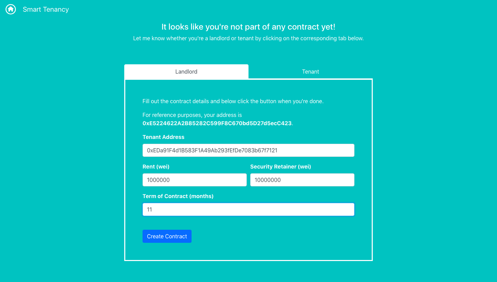
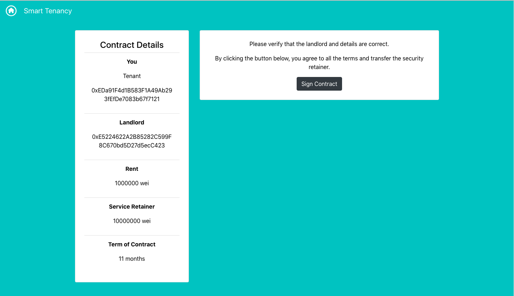
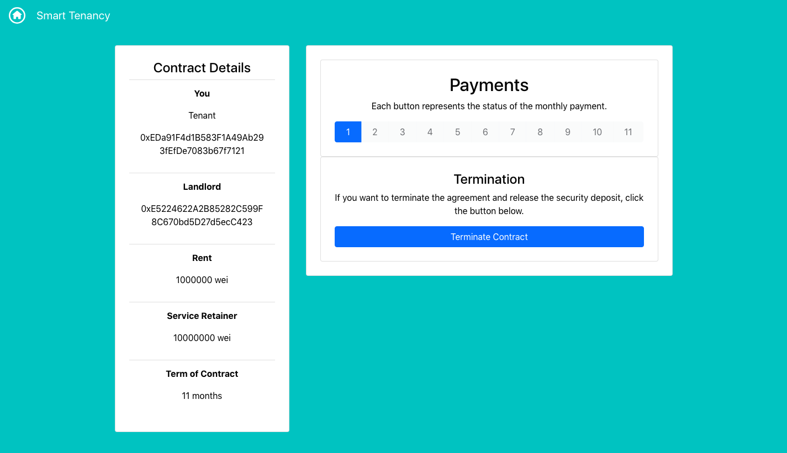
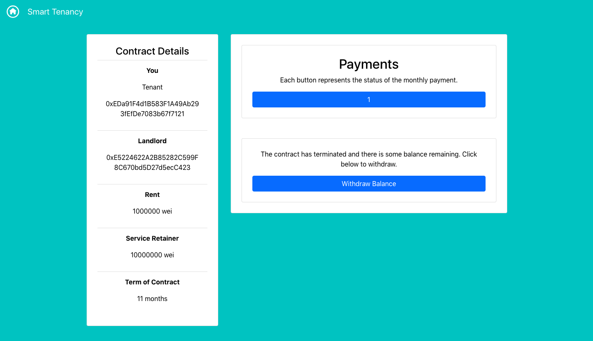

# Smart Tenancy

Smart Tenancy is a dapp (decentralized application) that secures the relationship between a landlord and a tenant and stores all interactions on the Ethereum blockchain.

It records interactions such as:
- The landlord & tenant signing the contract
- The tenant paying rent
- The landlord withdrawing the rent
- The tenant withdrawing security deposit after termination
- The landlord withdrawing any balance after termination

[]()
[]()
[]()
[]()

# Project Info

This project was built using Truffle, Drizzle, React.js, Redux, and Solidity. 

# Using the App

Currently, the dapp is not deployed on any mainnet or testnet, so you must run your own private node to use the dapp.

## Building

You can build the source by following these steps:

1. Run [Ganache](https://truffleframework.com/ganache).

2. Clone the repository.

```
git clone https://github.com/rahulmutt/smart-tenancy
```

3. Compile the Solidity files and deploy them.

```
cd [cloned-directory]
npm install
truffle migrate --reset
```

4. Run the web server.

```
cd app
npm install
npm run-script start
```

5. Open your browser to `http://localhost:3000` and make sure you have [Metamask](https://metamask.io/) installed.

# License

All source code hosted in this repository is licensed under the [MIT license](./LICENSE).

# Credits

The design and UX was contributed by [@Jyothsnasrinivas](https://github.com/Jyothsnasrinivas).